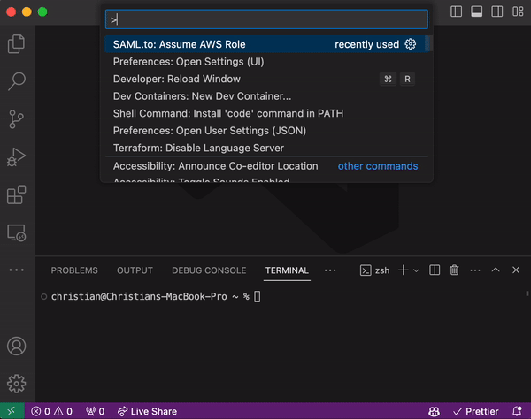

# SAML.to VSCode Extension

  

- Website: https://saml.to
- Forums: https://github.com/saml-to/vscode/discussions
- Documentation: https://docs.saml.to

## Introduction

This is the VSCode Extension for [SAML.to](https://saml.to). It allows for AWS role assumption within VSCode.

## Features

- Assume AWS Roles in VSCode
- Automatic Refreshes
- Automatically update `~/.aws/config` and `~/.aws/credentials` with: `AWS_ACCESS_KEY_ID`, `AWS_SECRET_ACCESS_KEY` and `AWS_SESSION_TOKEN`
- Works seamlessly with the [AWS Toolkit](https://marketplace.visualstudio.com/items?itemName=AmazonWebServices.aws-toolkit-vscode)

## Installation

Please make sure the following is installed:

- VSCode 1.84+

Then, install the VSCode Extension from the [VSCode Marketplace](https://marketplace.visualstudio.com/items?itemName=saml-to.saml-to-vscode).

## Getting Started

Once [the VSCode Extension is installed](#installation), run the following commands to login and assume roles:

- Open the Command Palette (`Cmd/Ctrl` + `Shift` + `P`)
- Choose `SAML.to: Assume AWS Role`

If no logins or roles are available, an administrator for an AWS account should complete the [initial setup](#Initial-Setup).

Add the `--help` flag to any command for available options.

## Extension Settings

- `github.token`: Provide a GitHub Token instead of using VSCode Authentication. This token requires the `user:email` scope. (Or by the `GITHUB_TOKEN` environment variable.)
- `assumeAws.assumeRoleAtStartup`: Automatically attempt to assume a role at startup. If `assumeAws.role` or `assumeAws.rememberRole` is set, the role prompt will be skipped.
- `assumeAws.autoRefresh`: Automatically refresh the credentials before they expire.
- `assumeAws.region`: The AWS Default Region to set after assuming a role. (Or by the `AWS_DEFAULT_REGION` environment variable.)
- `assumeAws.role`: Skip role selection input and assume this role. (Or by the `AWS_ROLE_ARN` environment variable.)
- `assumeAws.rememberRole`: Skip role selection input and assume the last role used. This is ignored when the `assumeAws.role` setting is set.
- `assumeAws.profile.name`: Save AWS Credentials to a named profile in `~/.aws/config`. (Or by the `AWS_PROFILE` environment variable.)

## Initial Setup

Visit [SAML.to Install](https://saml.to/install) to get started by connecting a GitHub User or Organization to an AWS Account.

## Reporting Issues

Please [Open a New Issue](https://github.com/saml-to/vscode/issues/new/choose) in GitHub if an issue is found with this tool.

## Maintainers

- [Scaffoldly](https://github.com/scaffoldly)
- [cnuss](https://github.com/cnuss)

## License

[Apache-2.0 License](LICENSE)
